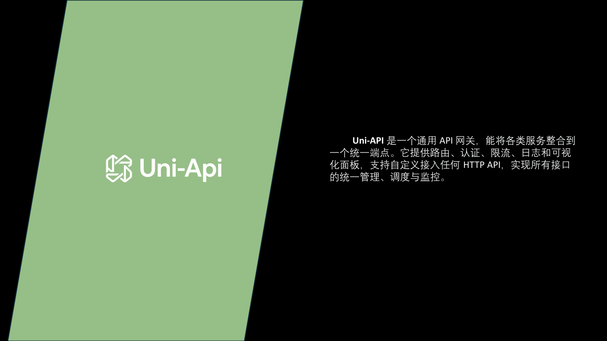
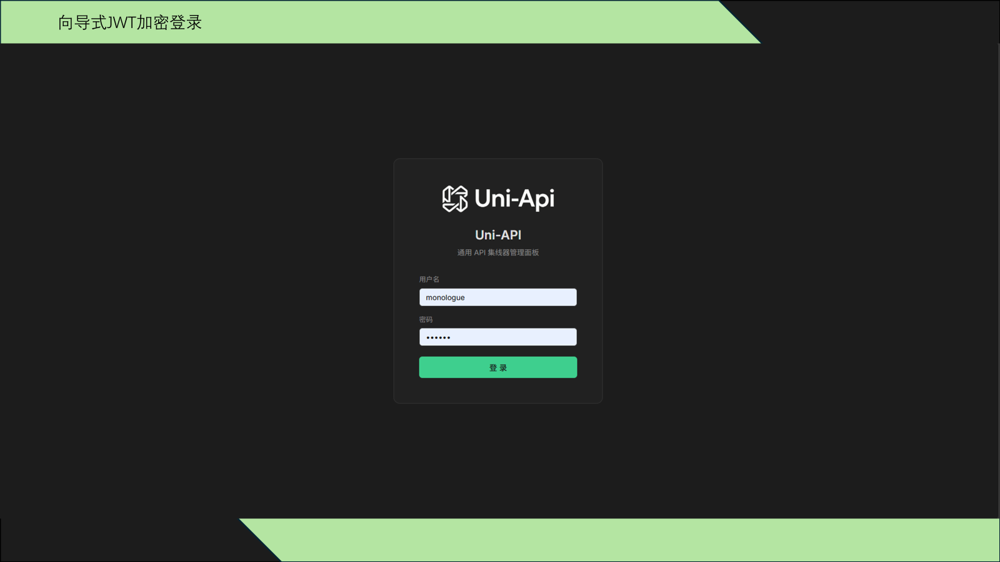
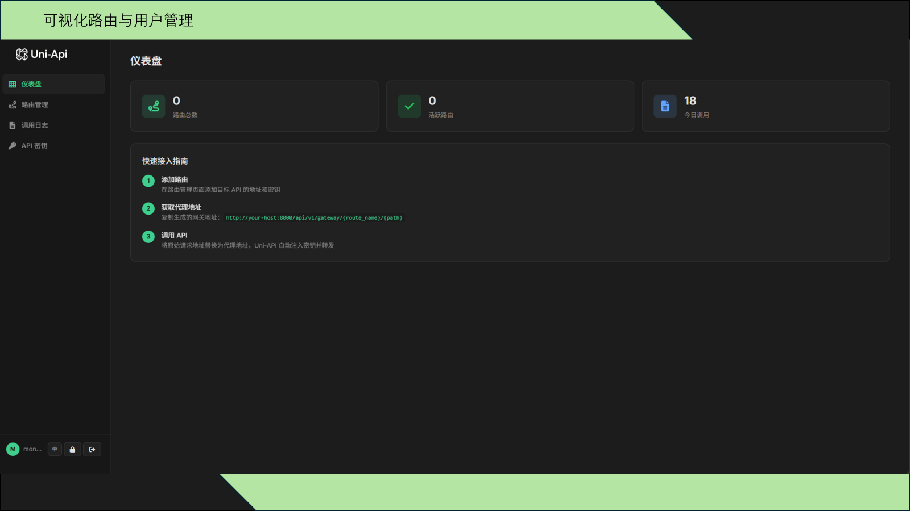
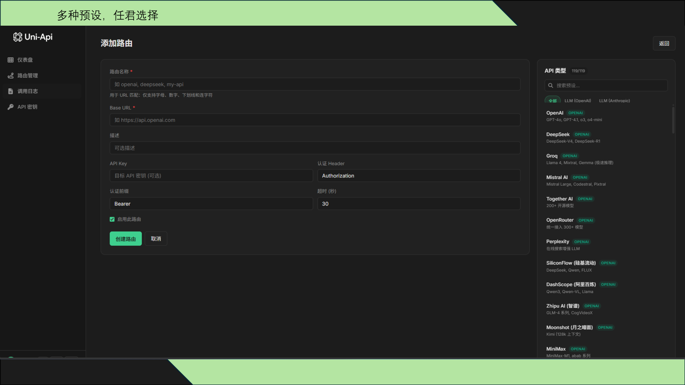
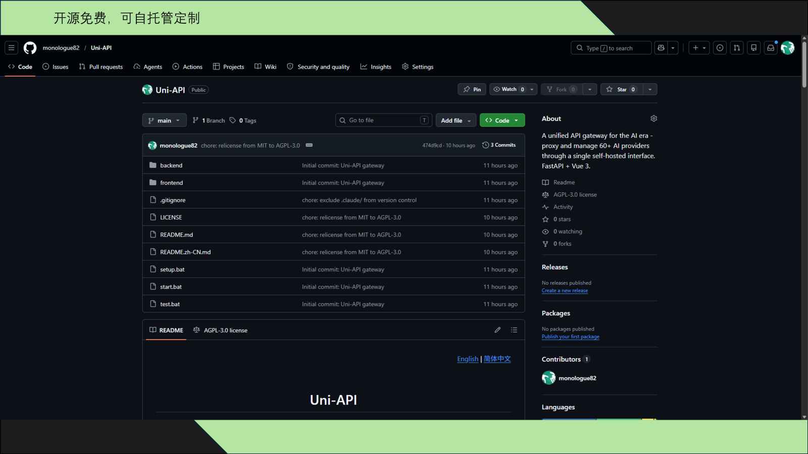

## 项目简介

**Uni-API** 是一个通用 API 网关，能将各类服务整合到一个统一端点。它提供路由、认证、限流、日志和可视化面板，支持自定义接入任何 HTTP API，实现所有接口的统一管理、调度与监控。

你是否有过这样的困扰：OpenAI Key、Claude Key、Gemini Key、DeepSeek Key、SiliconFlow Key……在代码里反复切换 `base_url` 和 `Authorization` 请求头？

Uni-API 把**所有这些服务都放在同一个端点后面**，你只需要一个地址、一个 Key，就能调用所有上游 API。

## 核心亮点

| 特性 | 说明 |
|------|------|
| **60+ 内置预设** | OpenAI、Anthropic、Google、Azure、DeepSeek、Groq、Mistral、Ollama 等应有尽有 |
| **透明代理** | 请求进，响应出——包括流式响应。无需修改任何 SDK |
| **路由级加密** | API Key 使用 Fernet 加密后存入 SQLite，安全无忧 |
| **实时模型发现** | 一键获取上游 `/v1/models` 列表 |
| **调用日志** | 每次请求都记录方法、路径、状态、延迟和请求 ID |
| **多用户认证** | JWT + bcrypt，首次启动向导式配置 |
| **自动缓存刷新** | 内存路由表每 30 秒自动刷新，无需重启 |
| **双语界面** | 英文 / 简体中文，导航栏一键切换 |

## 界面预览

### 登录界面



向导式 JWT 加密登录，首次使用自动引导创建管理员账户。

### 仪表盘



一目了然的数据面板：路由总数、活跃路由、今日调用量，配合快速接入指南，新手也能快速上手。

### 路由管理



**多种预设，任君选择。** 右侧预设面板包含 110+ 种 API 类型，覆盖 LLM、图像、音频、视频、嵌入等各类服务，点击即可快速创建。

### 开源免费



完全开源，可自托管定制。前后端分离架构，FastAPI + Vue 3 技术栈，AGPL-3.0 许可证。

## 系统架构

```
+------------------+        +-----------------------+        +-------------------+
|   你的客户端     |  HTTP  |   Uni-API 网关        |  HTTP  |   上游 API        |
|  (任何 SDK/应用) | -----> |  FastAPI + Vue Admin  | -----> |  OpenAI / Claude  |
|                  | <----- |  :8000 + :3000        | <----- |  / Gemini / ...   |
+------------------+        +-----------------------+        +-------------------+
                                       |
                                       v
                              +-------------------+
                              |  SQLite (async)   |
                              |  路由、用户、      |
                              |  调用日志、密钥    |
                              +-------------------+
```

网关是一个**透明反向代理**：重写上游 `base_url` 并注入上游 `Authorization` 请求头，然后原样流式返回响应。

## 快速开始

### 环境要求

- Python 3.11+
- Node.js 18+
- Windows / macOS / Linux

### Windows 一键启动

```bat
git clone https://github.com/monologue82/Uni-API.git
cd Uni-API
setup.bat
start.bat
```

### macOS / Linux

```bash
git clone https://github.com/monologue82/Uni-API.git
cd Uni-API

# 后端
python3 -m venv venv
source venv/bin/activate
pip install -r backend/requirements.txt

# 前端
cd frontend
npm install
cd ..

# 运行（两个终端）
# 终端 1
cd backend && ../venv/bin/python run.py

# 终端 2
cd frontend && npm run dev
```

启动后访问：

- **管理面板**: <http://localhost:3000>
- **API 文档 (Swagger)**: <http://localhost:8000/docs>
- **首次配置向导**: <http://localhost:3000/setup>

## 支持的服务

### 大语言模型

| 类别 | 服务 |
|------|------|
| **OpenAI 兼容** | OpenAI、DeepSeek、Groq、Mistral、Together、OpenRouter、Perplexity、SiliconFlow、DashScope、Zhipu、Moonshot、MiniMax、01.AI、StepFun、百度千帆、xAI、Fireworks、DeepInfra、Novita、Replicate、HuggingFace、Cloudflare Workers AI、Cohere、SambaNova、Lepton、Lambda、Anyscale、Upstage、InternLM、Baichuan、Spark、Doubao、腾讯混元、Ollama、LM Studio、vLLM |
| **Anthropic 兼容** | Anthropic Claude |
| **Google** | Google AI (Gemini)、Google Vertex AI |
| **Azure** | Azure OpenAI |

### 其他服务

| 类别 | 服务 |
|------|------|
| **AI 图像** | Stability AI、Ideogram、Flux API |
| **AI 音频** | ElevenLabs、Deepgram、PlayHT |
| **AI 视频** | Runway、Luma AI |
| **AI 嵌入** | Voyage AI、Jina AI |
| **开发者** | GitHub、GitLab、Bitbucket、Docker Hub、npm Registry |
| **自定义** | 任何 HTTP 端点 + 自定义认证方案 |

## 调用方式

创建一个名为 `my-openai` 的路由后，就像调用 OpenAI 一样调用它——只需替换基础 URL：

```bash
curl http://localhost:8000/api/v1/gateway/my-openai/v1/chat/completions \
  -H "Authorization: Bearer <your-uniapi-client-key>" \
  -H "Content-Type: application/json" \
  -d '{
    "model": "gpt-4o-mini",
    "messages": [{"role": "user", "content": "你好！"}]
  }'
```

网关会自动注入上游密钥，转发到 `https://api.openai.com/v1/chat/completions`，并流式返回响应。

## 项目结构

```
Uni-API/
├── backend/
│   ├── app/
│   │   ├── core/            # 缓存、HTTP 客户端
│   │   ├── middleware/      # 认证、错误处理
│   │   ├── models/          # SQLAlchemy 模型
│   │   ├── routers/         # 网关、路由、认证、日志、API 密钥
│   │   ├── schemas/         # Pydantic 模式
│   │   ├── services/        # API 类型、代理、路由服务、加密
│   │   ├── config.py
│   │   ├── database.py
│   │   └── main.py
│   ├── tests/
│   ├── requirements.txt
│   └── run.py
├── frontend/
│   ├── src/
│   │   ├── api/             # Axios 客户端
│   │   ├── components/
│   │   ├── i18n/            # en.js, zh.js
│   │   ├── router/
│   │   ├── stores/          # Pinia 状态管理
│   │   └── views/           # 仪表盘、路由、日志、密钥、设置、登录
│   ├── package.json
│   └── vite.config.js
├── setup.bat                # Windows：一键安装
├── start.bat                # Windows：一键运行
└── test.bat                 # Windows：运行集成测试
```

## 路线图

- [ ] 按密钥限流与配额管理
- [ ] 响应缓存 (Redis)
- [ ] 上游错误 Webhook 通知
- [ ] Docker 镜像 + docker-compose
- [ ] 可插拔认证 (OIDC, SAML)
- [ ] 按团队路由命名空间

## 许可证

本项目采用 **GNU Affero General Public License v3.0 or later** 许可证。

简单来说：
- 你可以自由使用、修改和分发本代码
- 如果你修改了代码并**将其作为网络服务提供**（包括公司内部使用），你必须以相同许可证发布修改后的完整源代码
- 不允许在不开源修改的情况下进行商业专有分叉

---


如果 Uni-API 帮你节省了几小时切换 `base_url` 的时间，欢迎给个 Star ⭐
